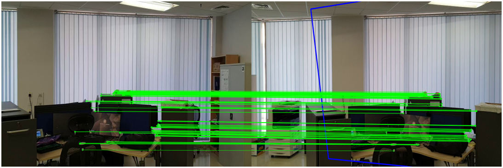

# Markerless Augmented Reality

## Introduction
This project involves Augmented reality without the use of markers. An image of an advert & video can be projected on a surface by persistent frame-by-frame homography tracking.  

## Description
In this work, an enhanced augmented reality system is built for a markerless scene. The system is to achieve four objectives: (1) Finding a clear planar surface for advert projection, (2) Perform augmented reality without markers (3) maintain augmented reality in and out of camera field-of-view (FOV), and (4) robustness to rotation and perspective changes. The approach to solving (1) is to use distance transform of gradients, (2) is solved via feature detection and matching, (3) is solved by persistent frame-by-frame Homography updates, and (4) is solved by fine-tuning (2) and (3).  

Algorithm:  
```
Step 1: Initialize
• Load Video Frames
• Image 0 ← Frame [0]
• ImageL ← Laplacian of Image 0
• ImageD ← Distance Transform of Image L
• Planar Region ← scan ImageD for max bounding rectangle
• TL, BL, BR, TR ← Planar region corners
Step 2: Persistent Homographies
• For all video frames:
• Select Frame[i] and Frame[i+1]
• Source ← Frame[i]
• Destination ← Frame[i+1]
• Compute source and destination feature-descriptor pairs using ORB.
• Retrieve source and destination Matches using Brute-Force.
• Compute 𝑯 using source and destination feature points with RANSAC
• Transform Planar region points using 𝑯
Step 3: Advert Warping
• Compute 𝑯𝟐 using advert and planar region corner points.
• Transform Advert corners to new planar region corners.
• Warp Advert into Frame[i+1] using 𝑯𝟐
```

## Results
  
Below image shows feature matching between Frame 0 and Frame 100 of a sample test video:  
  

Click image below to play video:  
[](https://youtu.be/kaR0zuAqziA)

